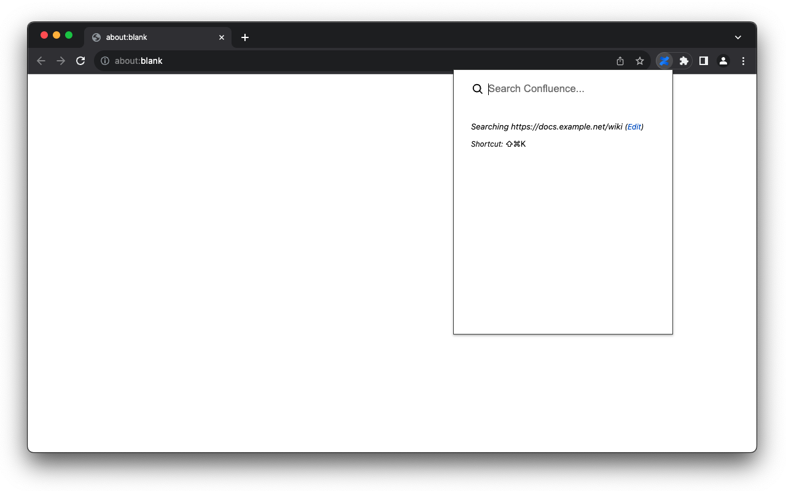

# confluence-quick-search

A cross-platform browser extension to make it easy to find information in your team's Confluence site.
Super fast search of your team's Confluence pages, by key command or by omnibox (a.k.a. the address bar)

## Install it:

- [Chrome Web Store](https://chrome.google.com/webstore/detail/confluence-quick-search/gimcmmlpmjffkpbomagapjhdfbbeldfk)
- [Firefox Extensions](https://addons.mozilla.org/en-US/firefox/addon/confluence-quick-search/)
- _Your preferred browser not listed? [Open an issue](https://github.com/anth0d/confluence-quick-search/issues/new) to request additional browser support._

## Screenshots

_Click the Confluence icon, or use a hotkey to start a quick search_

_Type `con ` and press space in a new tab to use the search shortcut._

# First time install

#### Add to your browser

#### Click the icon, or activate the keyboard shortcut, and specify your Confluence URL, including `/wiki` if present.

    https://your-confluence-url.atlassian.net/wiki

#### Ensure you are logged into your Confluence site in order to use this extension.

#### (optional, recommended) Set a keyboard shortcut

- Chrome: [Keyboard shortcuts](chrome://extensions/shortcuts)
- Firefox (optional): Visit [about:addons](about:addons) and click the gear icon to manage extension shortcuts.
  _Note that Firefox, unlike Chrome, enables the default shortcut_ `⌘+Shift+K` _automatically._

#### (optional, recommended) Pin the extension to your toolbar for easier access

# Developer docs

## Run locally

    git clone https://github.com/anth0d/confluence-quick-search.git
    cd confluence-quick-search
    npm install
    npm run watch:chrome

    # in another terminal
    npm run chrome

## Package a release

    ./package.sh
